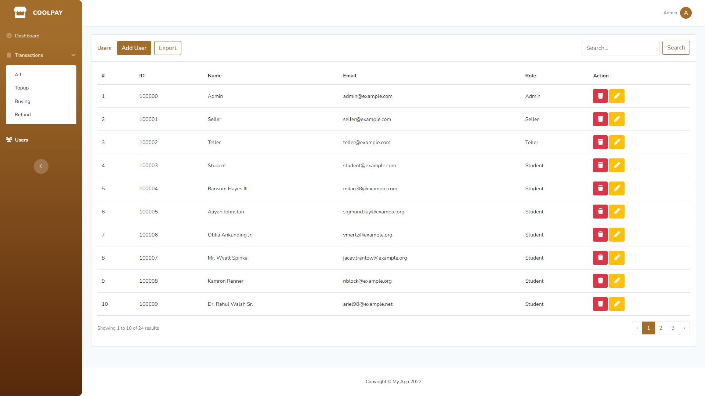

<p align="center"><kbd><a href="./public/assets/img/screenshot.png" target="_blank"></a></kbd></p>

<p align="center">
    <a href="https://laravel.com/docs/9.x"></a>
    <a href="https://getbootstrap.com/docs/5.0x"></a>
    <a href="https://fontawesome.com/icons"></a>
</p>
<h1 align="center"><b>School Fintech Template</b></h1>


## About
School Fintech Template is based on the [SB Admin 2 Laravel Component](https://github.com/rexencorp/sb-admin-2-component) template.

## How To Install
- Open your terminal
- Change directory you want
- Type `git clone --branch main https://github.com/rexencorp/school-fintech-template` in terminal
- After that, type `cd school-fintech-template` to enter the `school-fintech-template` directory
- Type `composer install` in terminal
- After that, type `npm install` in terminal 

## How to Run
- Create a database with the name `school-fintech-template` (you can change the database name)
- Type `cp .env.example .env` in terminal OR `copy .env.example .env` in cmd
- Adjust the `DB_DATABASE` in `.env` file according the database you created 
- Type `php artisan key:generate` in terminal
- Type `php artisan migrate --seed` in terminal
- After that serve the project with `php artisan serve` in your terminal
- Open http://127.0.0.1:8000/ in your browser.
- Voila! your project is ready to use

## Demo Account
| Email | Password | Role |
| :---  |   :---   | :--- |
| admin@example.com | password | Admin
| seller@example.com | password | Seller
| teller@example.com | password | Teller
| student@example.com | password | Student

## Model Fast Methods
Fast Methods makes it easy for you to manipulate databases through models
- **[User](#user-fast-methods)**
  -  [Fast Create](#user-fast-method-create)
  -  [Fast Delete](#user-fast-method-delete)
  -  [Fast Paginate](#user-fast-method-paginate)
  -  [Fast Update](#user-fast-method-update)
- **[Transaction](#transaction-fast-methods)**
  -  [Fast Approve](#transaction-fast-method-approve)
  -  [Fast Paginate](#transaction-fast-method-paginate)
  -  [Fast Reject](#transaction-fast-method-reject)
  -  [Fast Topup](#transaction-fast-method-topup)
- **[Item](#item-fast-methods)**
  -  [Fast Create](#item-fast-method-create)
  -  [Fast Delete](#item-fast-method-delete)
  -  [Fast Paginate](#item-fast-method-paginate)
  -  [Fast Update](#item-fast-method-update)

## User Fast Methods

<div id="user-fast-method-create"></div>

- ## Fast Create
  Syntax:
  ```
    User::fastCreate($data, $password);
  ```

  Example:
  ```
    public function store(Request $request) {
        User::fastCreate($request);
    }
  ```

    Parameters:\
    `$data` - Data for create user. Can be array, object or instance of Request \
    `$password` **_(optional)_** - Only string type allowed, defaults to `'password'`
    
    ***

<div id="user-fast-method-delete"></div>

- ## Fast Delete
    Syntax:
    ```
        User::fastDelete($user);
    ```
    
    Example:
    ```
        public function destroy(User $user) {
            User::fastDelete($user);
        }
    ```
    OR
    ```
        public function destroy($userId) {
            User::fastDelete($userId);
        }
    ```

    Parameters:\
    `$user` - Instance of User model or user id
    
    ***

<div id="user-fast-method-paginate"></div>

- ## Fast Paginate
    Syntax:
    ```
        User::fastPaginate($request);
    ```
    
    Example:
    ```
        public function index(Request $request) {
            $users = User::fastPaginate($request);

            return view('users.index', compact('users'));
        }
    ```

    Parameters:\
    `$request` **_(Optional)_** - Instance of Request, object or array
    
    ***

<div id="user-fast-method-update"></div>

- ## Fast Update
    Syntax:
    ```
        User::fastUpdate($data, $user, $password);
    ```
    
    Example:
    ```
        public function update(Request $request) {
            User::fastUpdate($request);
        }
    ```

    Parameters:\
    `$data` - Data for update user. Can be array, object or instance of Request \
    `$user` **_(optional)_** - Instance of User model or user id, defaults to logged in user \
    `$password` **_(optional)_** - Only string type allowed, defaults to `'password'`

    &nbsp;

## Transaction Fast Methods

<div id="transaction-fast-method-approve"></div>

  - ## Fast Approve
    Syntax:
    ```
      Transaction::fastApprove($transaction);
    ```
    
    Example:
    ```
      public function approve(Transaction $transaction) {
          Transaction::fastApprove($transaction);
      }
    ```
    OR
    ```
      public function approve($transactionId) {
          Transaction::fastApprove($transactionId);
      }
    ```

    Parameters:\
    `$transaction` - Instance of Transaction model or transaction id to be approve, transaction type must be type of `topup`

    ***
  
  - ## Fast Paginate
    Syntax:
    ```
        Transaction::fastPaginate($request);
    ```
    
    Example:
    ```
        public function index(Request $request) {
            $users = Transaction::fastPaginate($request);

            return view('users.index', compact('users'));
        }
    ```

    Parameters:\
    `$request` **_(Optional)_** - Instance of Request, object or array
    
    ***

  - ## Fast Reject
    Syntax:
    ```
      Transaction::fastReject($transaction);
    ```
    
    Example:
    ```
      public function reject(Transaction $transaction) {
          Transaction::fastReject($transaction);
      }
    ```
    OR
    ```
      public function reject($transactionId) {
          Transaction::fastReject($transactionId);
      }
    ```

    Parameters:\
    `$transaction` - Instance of Transaction model or transaction id to be reject, transaction type must be type of `topup`

    ***


## License

The School Fintech Template is open-sourced template licensed under the [MIT license](https://opensource.org/licenses/MIT).
